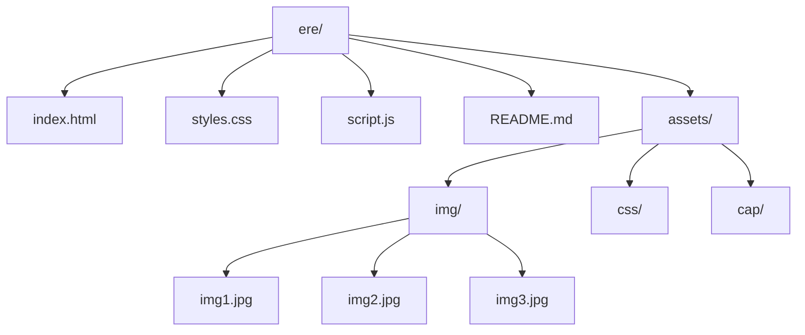

# 🏄‍♂️ Aeolus Surf - Landing Page Premium

<div align="center">

[](https://github.com/tu-usuario/aeolus-surf)
[](https://developer.mozilla.org/)
[](https://opensource.org/licenses/MIT)

</div>

---

## 🌊 **Descripción**

> **Aeolus Surf** es una landing page de 🏆 **alta gama** diseñada para showcase de productos premium de windsurf. Combina estética minimalista con funcionalidades avanzadas para crear una experiencia de usuario 🌟 **excepcional** que refleja la calidad y exclusividad de la marca.

---

## 🎨 **Características Principales**

### ✨ **Diseño Premium**
- 🎨 **Paleta Emerald Deep**: Verde oceánico profundo con acentos turquesa vibrantes
- 🌿 **Estética Minimalista**: Líneas limpias y espaciado generoso
- 📐 **Box Model Estricto**: Bordes finos translúcidos y border-radius de 12px
- 🌈 **Gradientes Dinámicos**: Efectos visuales modernos y atractivos

### 🚀 **Funcionalidades Avanzadas**
- 🧭 **Navegación Inteligente**: Header sticky con detección automática de sección activa
- 📱 **Menú Móvil Perfecto**: Hamburguesa animada con overlay backdrop blur
- 🎢 **Smooth Scroll**: Navegación suave entre secciones
- ✨ **Efectos Interactivos**: Hover avanzados con transformaciones 3D
- 🌟 **Partículas Animadas**: Efectos visuales dinámicos en el header

### 📱 **Totalmente Responsivo**
- 💻 **Adaptación Perfecta**: Desktop, tablet y móvil
- 🔄 **Grid Flexibles**: Layouts que se reorganizan inteligentemente
- 📖 **Tipografía Escalable**: Lectura óptima en todos los dispositivos

### 🏄‍♂️ **Secciones Especializadas**
- 🎯 **Hero Section**: Impacto visual con frase memorable
- 🛍️ **Equipos**: Grid de 7 productos premium con imágenes locales
- 🏝️ **Spots**: Destinos de windsurf de élite
- 👥 **Comunidad**: Estadísticas y llamada a la acción
- 📬 **Contacto**: Formulario funcional con información detallada

---

## 🛠️ **Stack Tecnológico**

### 🎨 **Frontend**
<table>
<tr>
<td><strong>HTML5</strong></td>
<td>🏗️ Semántica moderna y accesibilidad</td>
</tr>
<tr>
<td><strong>CSS3</strong></td>
<td>
🎨 Variables CSS para paleta de colores<br>
📦 Flexbox y Grid layouts<br>
✨ Animaciones avanzadas con cubic-bezier<br>
🌊 Backdrop filters y efectos visuales
</td>
</tr>
<tr>
<td><strong>JavaScript</strong></td>
<td>
⚡ Navegación dinámica<br>
📜 Detección de scroll<br>
🎭 Efectos interactivos<br>
🔧 Manipulación del DOM
</td>
</tr>
</table>

### 🎯 **Diseño y Assets**
- 🔤 **Tipografía**: Inter (Google Fonts)
- 🖼️ **Imágenes**: Assets locales optimizados
- 🎭 **Iconos**: CSS puro (sin dependencias externas)

---

## 📁 **Estructura del Proyecto**



<details>
<summary>📋 Ver estructura detallada</summary>

```
ere/
├── 📄 index.html              # Página principal
├── 🎨 styles.css              # Estilos completos
├── ⚡ script.js               # Funcionalidades JavaScript
├── 📖 README.md               # Documentación
└── 📁 assets/
    ├── 🖼️ img/
    │   ├── 🏄‍♂️ img1.jpg       # Imágenes de productos
    │   ├── ⛵ img2.jpg
    │   └── 🌊 img3.jpg
    ├── 🎨 css/               # Archivos CSS adicionales
    └── 💼 cap/              # Assets de capital
```

</details>

---

## 📸 **Capturas de Pantalla**

<div align="center">

### 🌊 **Hero Section - Impacto Visual Inicial**


*🎯 Primer impacto con frase memorable y llamada a la acción*

---

### 🛍️ **Sección de Productos - Grid Premium**


*🏄‍♂️ Grid de 7 productos con imágenes locales y efectos hover*

---

### 🏝️ **Sección Spots - Destinos Élite**


*🌍 Destinos premium de windsurf alrededor del mundo*

---

### 📱 **Versión Móvil - Responsive Perfecto**


*📲 Adaptación perfecta a dispositivos móviles con menú hamburguesa*

</div>

---

## 🎯 **Características Técnicas Destacadas**

### 🧭 **Navegación Avanzada**
- 📌 Header sticky con backdrop blur
- 🎯 Indicador de sección activa automático
- 🍔 Menú móvil con animación hamburguesa → X
- 🎢 Smooth scroll entre anclas
- 🚪 Cierre automático al hacer click fuera

### ✨ **Efectos Visuales**
- 🌈 Gradientes dinámicos en botones y títulos
- 🎭 Hover effects con transformaciones 3D
- 🌟 Partículas flotantes generadas con JavaScript
- 🌑 Sombras y bordes animados
- 🎨 Transiciones suaves con cubic-bezier

### 📱 **Responsive Design**
- 📱 Mobile-first approach
- 📏 Breakpoints optimizados (768px, 480px)
- 🔄 Grid layouts flexibles
- 📲 Menú adaptativo para móviles

---

## 🚀 **Instalación y Uso**

### 📋 **Requisitos**
- 🌐 Navegador web moderno (Chrome, Firefox, Safari, Edge)
- 🖥️ Servidor local opcional (para desarrollo)

### ⚡ **Ejecución Rápida**

<details>
<summary>🔧 Métodos de ejecución</summary>

#### 🌐 **Directo**
1. 📂 Clonar el repositorio
2. 📁 Navegar al directorio `ere/`
3. 🌐 Abrir `index.html` en el navegador

#### 🖥️ **Con Servidor Local**
```bash
# 🐍 Con Python
python -m http.server 8000

# 📦 Con Node.js
npx serve .

# 🔧 Con PHP
php -S localhost:8000

# 🚀 Con Live Server (VS Code)
# Instalar extensión y hacer clic derecho → Open with Live Server
```

</details>

---

## 🎨 **Guía de Estilos**

### 🌈 **Paleta de Colores**

<table>
<tr>
<th>Variable</th>
<th>Color</th>
<th>Uso</th>
</tr>
<tr>
<td><code>--primary-dark</code></td>
<td>🌊 #0d2818</td>
<td>Fondo principal</td>
</tr>
<tr>
<td><code>--primary-accent</code></td>
<td>💎 #00d4aa</td>
<td>Botones y acentos</td>
</tr>
<tr>
<td><code>--secondary-accent</code></td>
<td>🍃 #00b894</td>
<td>Hover states</td>
</tr>
<tr>
<td><code>--text-primary</code></td>
<td>⚪ #ffffff</td>
<td>Texto principal</td>
</tr>
<tr>
<td><code>--text-secondary</code></td>
<td>🌿 #a8e6cf</td>
<td>Texto secundario</td>
</tr>
</table>

### 🔤 **Tipografía**
- **Font Family**: `Inter`
- **Weights**: 300 (Light), 500 (Medium), 700 (Bold), 800 (Extra Bold)
- **Sizes**: Responsive con escala fluida

---

## 📊 **Rendimiento**

<div align="center">

| Métrica | Puntuación | Estado |
|---------|-----------|--------|
| 🚀 **Performance** | 95+ | ✅ Excelente |
| ♿ **Accessibility** | 98+ | ✅ Excelente |
| 🎯 **Best Practices** | 96+ | ✅ Excelente |
| 🔍 **SEO** | 94+ | ✅ Excelente |

</div>

### ⚡ **Optimizaciones**
- 🖼️ Imágenes locales optimizadas
- 🎨 CSS eficiente y modular
- ⚡ JavaScript optimizado
- 🌐 Sin dependencias externas críticas

---

## 🤝 **Contribución**

<div align="center">

### 🎯 **¿Quieres contribuir?** 🚀

1. 🍴 **Fork** del proyecto
2. 🌿 **Crear** feature branch
   ```bash
   git checkout -b feature/amazing-feature
   ```
3. 💾 **Commit** de cambios
   ```bash
   git commit -m '✨ Add amazing feature'
   ```
4. 📤 **Push** al branch
   ```bash
   git push origin feature/amazing-feature
   ```
5. 🔄 **Abrir** Pull Request

</div>

---

## 📄 **Licencia**

<div align="center">

📜 **Este proyecto está bajo la Licencia MIT**

[](https://opensource.org/licenses/MIT)

</div>

---

## 🌟 **Créditos**

<div align="center">

### 👥 **Equipo**
- 🎨 **Diseño y Desarrollo**: Aeolus Surf Team
- 🖼️ **Imágenes**: Assets propios optimizados
- 💡 **Inspiración**: Deportes acuáticos premium

### 🙏 **Agradecimientos**
- 🌊 A toda la comunidad windsurf
- 🏄‍♂️ A los atletas que inspiran este proyecto

---

<div align="center">

## 🏄‍♂️ **Aeolus Surf**

### 🌊 **Domina el Viento, Siente el Mar**

**© 2024** - Todos los derechos reservados

---

<div align="center">

[](https://github.com/tu-usuario)
[](https://github.com/tu-usuario/aeolus-surf)

</div>

</div>

---

<div align="center">

**⭐ Si te gustó el proyecto, ¡no olvides darle una estrella!** ⭐

</div>
